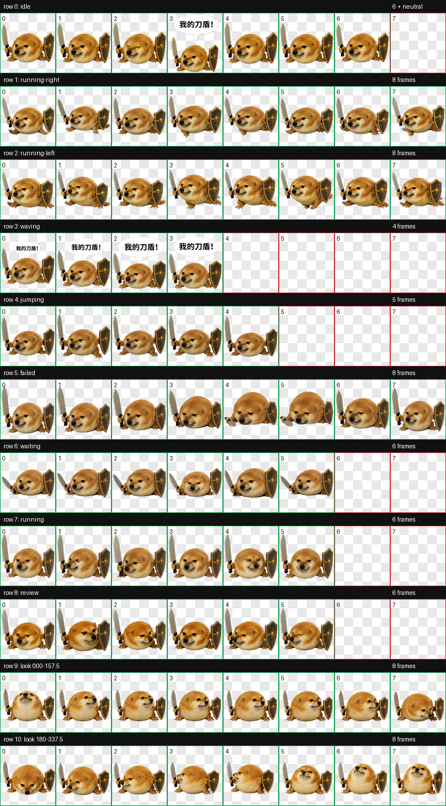

# 刀盾狗（Codex Pet）

一只低趴、圆滚滚、左手持刀右手举盾的 Codex v2 动态宠物。空闲循环中会间歇弹出气泡：**“我的刀盾!”**



## 安装

1. 下载本仓库。
2. 将 `pet.json` 和 `spritesheet.webp` 复制到：

   ```text
   %USERPROFILE%\.codex\pets\daodun\
   ```

3. 在 Codex 的宠物选择器中选择“刀盾狗”。

## 内容

- `spritesheet.webp`：Codex v2 精灵图，1536 × 2288，包含 9 组标准动画。
- `pet.json`：宠物清单。
- `preview/contact-sheet.png`：动作总览。
- `preview/look-directions.png`：16 向观察动作预览。
- `preview/speech-bubble.gif`：带“我的刀盾!”气泡的挥手动画。
- `preview/periodic-greeting.gif`：空闲时的间歇喊话预览。

## 质量检查

- 9 组标准动画均已逐项检查。
- 16 个观察方向通过方向与连续性验证。
- 刀与盾在全部动作中保持与角色连接。
- 透明边缘、画布越界和 Codex v2 结构检查通过。

## 来源与声明

这是根据用户提供的网络梗图视觉意象创作的非官方同人宠物，与原图作者、权利人或 OpenAI 均无隶属或背书关系。原始参考图未收入本仓库。

本仓库中的生成美术在贡献者有权许可的范围内按 [CC BY 4.0](LICENSE-ASSETS.md) 提供；配置和文档按 [MIT License](LICENSE) 提供。网络梗图、角色意象、名称或其他第三方元素可能另受权利保护，使用者应自行确认其使用场景。

## English

An unofficial Codex v2 animated pet inspired by the sword-and-shield dog meme. The original reference image is not included. Its idle loop periodically shows “我的刀盾!” (“My sword and shield!”).
